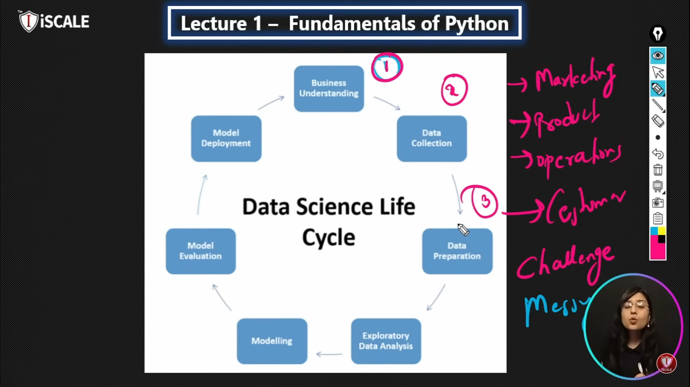

# Table Of Content
[1-Headings](#1-headings)\
[2-Block Of Words/ cititation](#2-how-to-add-block-of-words)\
[3-Line Breaks](#3--line-breaks-by-back-slash)\
[4-Words Faces](#4-word-face)\
[5-List & Bullet Points](#5-bullet-points--lists)\
[6-Line Break](#6-line-breake-or-page-breaks)\
[7-Links & HyperLinks](#7-links--hyperlinks)\
[8-Images](#8-images--figures-with-links)\
[9-Code Block](#9-how-to-add-code-block)\
[10-Tables](#10-how-to-add-table)

---
# 1-Headings
***How to give Headings in markdown files***
## Heading 2
### Heading 3
#### Heading 4

---

# 2-How to add block of words

This is simple way to add block of words in markdown file but you can use a special way.


## Course description
> **AI** is transforming how we live, work, and play.
> By enabling new technologies like self-driving cars and recommendation systems or improving old ones like medical diagnostics and search engines, the demand for expertise in AI and machine learning is growing rapidly. 
> This course will enable you to take the first step toward solving important real-world problems and future-proofing your career.
>
> **CS50’s Introduction to Artificial Intelligence** with Python explores the concepts and algorithms at the foundation of modern artificial intelligence, diving into the ideas that give rise to technologies like game-playing engines, handwriting recognition, and machine translation. Through hands-on projects, students gain exposure to the theory behind graph search algorithms, classification, optimization, reinforcement learning, and other topics in artificial intelligence and machine learning as they incorporate them into their own Python programs. By course’s end, students emerge with experience in libraries for machine learning as well as knowledge of artificial intelligence principles that enable them to design intelligent systems of their own.

---

## 3- Line Breaks By Back Slash

**AI** is transforming how we live, work, and play.\
By enabling new technologies like self-driving cars and recommendation systems or improving old ones like medical diagnostics and search engines, the demand for expertise in AI and machine learning is growing rapidly.\
This course will enable you to take the first step toward solving important real-world problems and future-proofing your career.

---

## 4-Word Face
**Bold**   __Bold__  \
*Italic*   _Italic_  \
***Bold + Italic***   ___ Bold + Italic___

---

# 5-Bullet Points / Lists

> You can make a list by - ,1. , * ,+ \
> Here is an example of a list

> **List In Simple Format**

- Day-1
    - Introduction to Python
- Day-2
    - Introduction to Python
      - Part 1
      - Part 2
      - Part 3
      - Part 4
- Day-3
    - Introduction to Python
      - OOP
      - DSA
      - File Handling
- Day-4
    - Jupyter Notebook
- Day-5
    - Markdown Language

> **List In Numbers Format**

1. Day-1
2. Day-2
3. Day-3
4. Day-4
5. Day-5
   1. Markdow Language

---

# 6-Line Breake OR Page Breaks

This is my markdown practice
=====================================

---
***
this is my page
___
this is my page look

---

# 7-Links & HyperLinks

<abubakarikram16@gmail.com>\
<https://www.github.com/abubakarikram16>\
<https://www.linkedin.com/in/abubakarikram16>

>__HyperLink__\
[Python Ka Chilla  By Aammar](https://codanics.com/courses/python-ka-chilla-for-data-science-40-days-of-python-for-data-science/lesson/markdown-language-crash-course/)


[Codanics]:https://codanics.com/courses/python-ka-chilla-for-data-science-40-days-of-python-for-data-science/lesson/markdown-language-crash-course/
If you want to Enroll in the course please visit [Our Site][Codanics]

---

# 8-Images & Figures With Links

For File HyperLink    [Click to veiw Photo](a.png)   


For Online Picture Link
[PMAS](https://www.google.com/imgres?q=pmas&imgurl=https%3A%2F%2Fwww.uaar.edu.pk%2Fslideshow%2Fadmin-190824.JPG&imgrefurl=https%3A%2F%2Fwww.uaar.edu.pk%2Findex.php&docid=SU3-Ra5cCRQRQM&tbnid=cAguKgYJ5L69lM&vet=12ahUKEwii5drFot6KAxWfzwIHHb05PZ0QM3oECDcQAA..i&w=1100&h=421&hcb=2&ved=2ahUKEwii5drFot6KAxWfzwIHHb05PZ0QM3oECDcQAA)


---

# 9-How to add Code BLock
`print("Python")`

```python
x = 6
y = 7
print(x+y)

``` 

```R

x= 5;
y = 6;
printf("%d",x+y);

```

---

# 10-How to add Table

| Name | Age | Class |
| :---- | :----: | :----: |
| Abubakar | 24 | BSCS |
| Hammad | 25 | BSCS |
| Usma | 26 | BSCS |
| Fatimah|22 | BSCS |

----

# 11-Extensions
